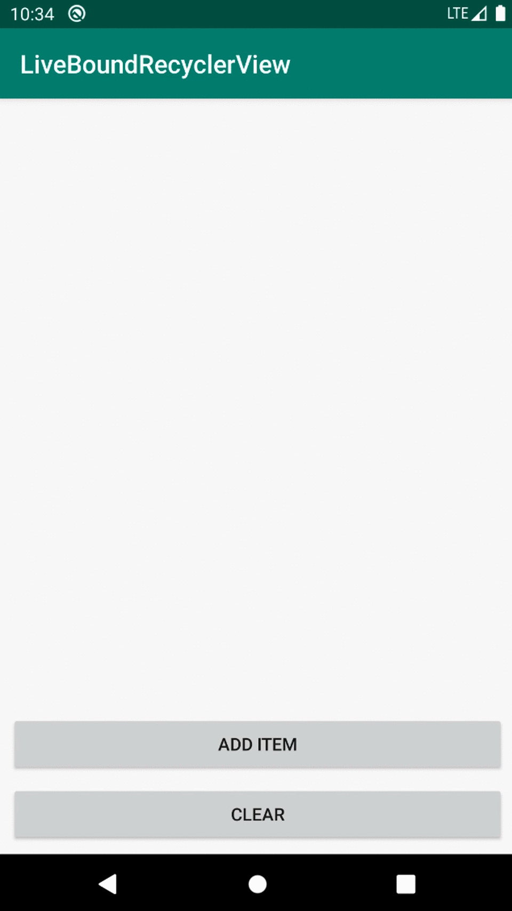

# LiveBoundRecyclerView
Example of a dynamic RecyclerView that binds each ViewHolder to data for its position in the adapter

### Use case:
Displaying a rapid stream of data that updates frequently, as in the case of displaying Bluetooth scan results in real time.

### The problem:
Scan results are generally stored in a list and displayed by a RecyclerView. The scanner often picks up a peripheral multiple times, so we check the list for duplicates before adding new items. In doing so, we lose the ability to display the latest RSSI (signal strength) of each peripheral. We can simply update the list item of a previously scanned peripheral, but the adapter still needs to rebind every time to display the new data.

### The solution:
Instead of notifying the adapter every time an item is updated, we can utilize the Data Binding Library to bind each view only once with a reference to its specific position in the list. As data updates, views observe the change at their adapter position and the UI reacts immediately.

### Significance
This method of binding views directly to corresponding data greatly reduces the number of times the adapter needs to be notified. This saves calls to .notifyDataSetChanged() or .calculateDiff(), which are now only necessary when list items are added or rearranged. The result is a dynamic display of data that automatically updates as the data itself changes.

## How to implement
The LiveBoundRecyclerView only requires two things to run:
- A data binding layout file containing two variables:  
  `<variable name="position" type="Integer" />`  
  `<variable name="viewModel" type="com.package.YourViewModel" />` [(example)][1]
- A ViewModel with a publicly exposed LiveData list [(example)][2]

[1]:https://github.com/augustgrun/LiveBoundRecyclerView/blob/master/app/src/main/res/layout/list_item.xml
[2]:https://github.com/augustgrun/LiveBoundRecyclerView/blob/master/app/src/main/java/com/augustg/liveboundrecyclerview/MainViewModel.kt
